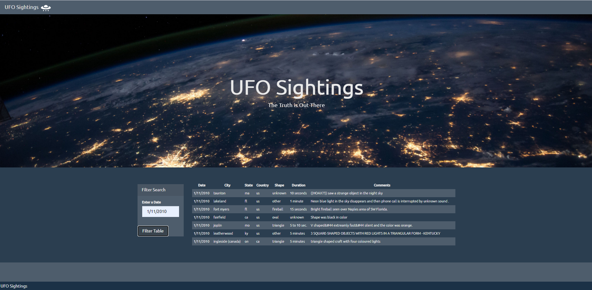
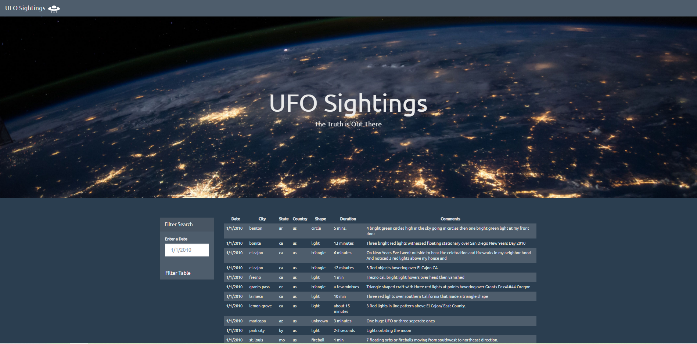

# javascript-challenge

Using the UFO dataset provided in the form of an array of JavaScript objects, wrote code that appends a table to my web page and then adds new rows of data for each UFO sighting.
Used a date form in my HTML document and write JavaScript code that will listen for events and search through the date/time column to find rows that match user input.

### Index Page with Table ###
 

### Filtered Data ###
 
